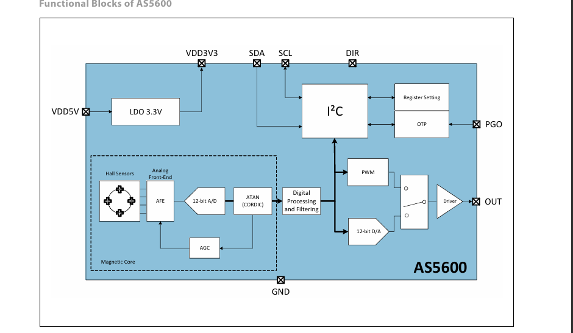
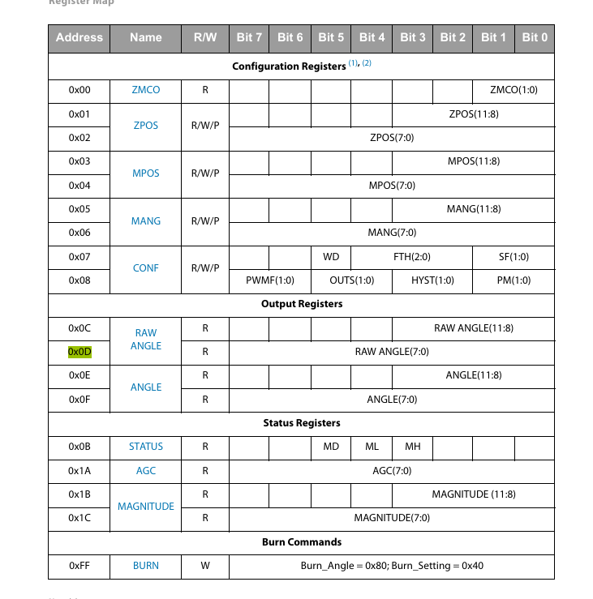
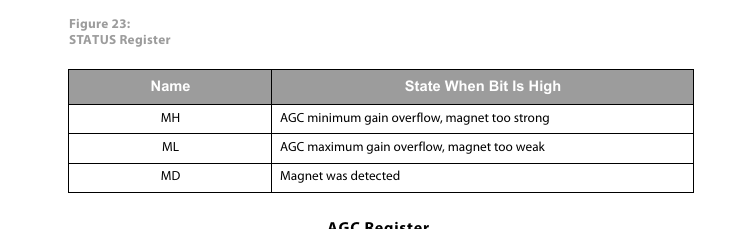

# Working of this module

- We get 12bit value from the encoder
- 4096 possible values
- default address of as5600 is 0x36

in general, values are stored in registers

the values are written into addresses at 0x0C and 0x0D.
8 + 8 = 16Bit value out of which only 12 is used

In i2c, SD is data pin and SC is control pin

to convert to rawvalues we use raw/4096*360

functions used:

getRawAngle()

why are we typecasting into int32

so from control systems we can borrow the topic of automatic gain control
when the magnetic field is weak, the gain is increased and when the MF is strong gain is decreased

isAGCmaxGainOverflow()
isAGCminGainOverflow()

isMagnetDetected()