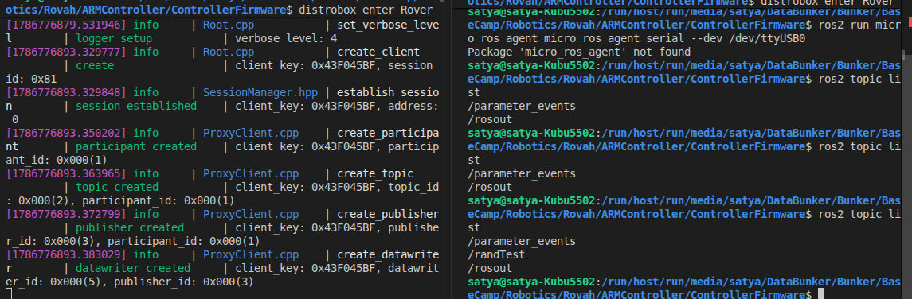
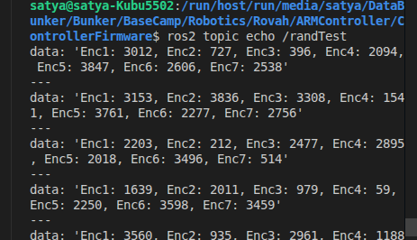

source install/setup.bash
ros2 run micro_ros_agent micro_ros_agent serial --dev /dev/ttyUSB0

# Start micro_ros_agent and press the physical EN/RESET button on the ESP32

### Testing and Setting up ESP32 with Microros

code:

Short Summary of src/main.cpp
Goal: Simulates 7 joint encoder values (12-bit range 0–4095) and streams them as a formatted string to ROS 2 topic /randTest.
Publish Rate: Publishes once every 200 ms (5 Hz) using non-blocking timers (millis()).
Core Functions Breakdown
generateRandomEncoderValue(min, max) Uses ESP32 silicon hardware noise (esp_random()) to generate a random 12-bit encoder value between 0 and 4095.

generateEncoderString(buffer, size) Generates 7 random encoder readings and formats them into a single string: "Enc1: 1024, Enc2: 4095, Enc3: 250, Enc4: 3120, Enc5: 1800, Enc6: 512, Enc7: 3300"

setupMicroROS()

Initializes micro-ROS USB Serial transport (set_microros_transports()).
Configures dynamic memory allocator.
Registers the ROS 2 node (esp32_random_publisher) and publisher for topic /randTest.
publishRandomMessage() Updates the message payload buffer with fresh encoder string data and transmits it to ROS 2 via rcl_publish().

error_loop() If micro-ROS initialization fails during boot, it traps the board in an infinite loop that blinks the onboard LED fast (100 ms).

Onboard LED Status Guide
Blinking Fast (100 ms): Startup error / Agent not connected yet. (Solution: Start micro_ros_agent and press the physical EN/RESET button on the ESP32).
Solid ON: Successfully connected and actively publishing data to ROS 2 topic /randTest.

# Let's now work with the encoder

Thing about this is that the esp32 has to retrieve every value one by one
every encoder's value one by one

it is a 16 to 1 mux but we will keep track of only 7
encoders so we will only use 7 addresses

each address is to be iterated through everytime and retrieve the values and collect and publish each encoder's value.
we can do this once every 200ms

We will be working with an ARM controller. We will be using ESP32 for that. 
There are 7 AS5600 Encoders that are connected to (or to be connected) to the ESP32.
Each encoder will be giving a value which has to be published as a Ros2 topic. 

Microros is in /run/media/satya/DataBunker/Bunker/BaseCamp/Robotics/Rovah/ARMController/microros_ws

Now, You have to write a very modular code. It should be extremely easy to understand and debug for someone who does not know how to work with Embedded systems.

You have to use Arduino MicroROS for this.

The agent is already setup in "distrobox enter Rover"

We can do this phase-wise
RIght now, The encoders are not ready.
 
For now, I want you to write code to randomly generate 7 different values and return a string with all encoder values as a ros topic called as "/RandTest"
The code should be extremely well documented and easy to understand and functions should be simple.

Now, Let's start with the encoders. 

